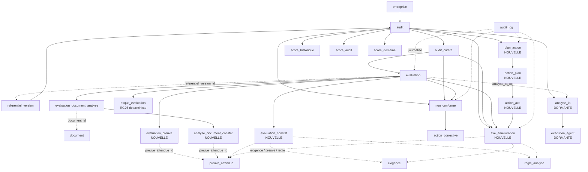

# PHASE 5.7-B — Schéma cible et plan de migration

## Résultats IA V2 — SMARTEX SUSTWAY

> **Phase de conception. Aucune migration, aucun `ALTER`, aucune écriture,
> aucune modification d'entité, de dépôt, de service, d'endpoint, de Python
> ou du frontend. Aucun commit.**
>
> Toute mesure citée provient d'une interrogation réelle de la base
> `smartex_sustway` ou d'une lecture du code, menée pendant cette phase. Ce
> qui n'est pas établi porte la mention **À CONFIRMER** ou **NON DÉMONTRÉ
> DANS L'EXISTANT**. Aucune orientation du brief n'est présentée comme une
> décision actée : le dépôt ne contient aucune décision métier formelle sur
> ces points.

---

## 1. Résumé exécutif

Le schéma cible repose sur **quatre principes** et se traduit par **7
nouvelles tables**, **28 nouvelles colonnes** (13 sur les tables de
résultat, 15 sur les tables techniques), **2 tables dormantes à activer** et
**une permission nouvelle**. Aucune table existante n'est
supprimée. Aucune ligne existante n'est détruite.

### Deux constats de cette phase qui modifient le brief

**1. La version du référentiel est déjà épinglée, et de façon immuable.**

```
audit.referentiel_version_id : uuid NOT NULL
```

L'entité `Audit` ne l'expose qu'en lecture — elle est affectée dans le
constructeur, et `grep -rn "setReferentielVersion"` ne rend **aucun
résultat**. La version est donc fixée à la création de la mission et ne peut
pas changer.

Le brief demande de donner à `evaluation.version_referentiel` (varchar, nulle
sur 44/44) le rôle d'identifier la version exacte. **Ce rôle est déjà tenu**,
et mieux tenu, par une clé étrangère `NOT NULL`. Remplir un varchar avec un
numéro de version dupliquerait une information déjà fiable sous une forme
plus faible. Le §16 propose la réponse : une **FK sur l'évaluation**, qui
n'apporte rien aujourd'hui mais protège d'une évolution, et l'abandon du
varchar plutôt que son remplissage.

**2. Les chiffres « 39 NC / 28 doublons / 11 groupes » se réconcilient.**

Mesuré :

```
 nc_total                 | 39
 criteres_porteurs_de_nc  | 22
 groupes_dupliques        | 11
 lignes_en_trop           | 17
 statut OUVERTE           | 39
```

**28 lignes vivent dans les 11 groupes dupliqués ; 17 d'entre elles sont en
excès** (28 − 11). Les deux chiffres du brief décrivent donc deux choses
différentes et sont tous deux exacts. La migration doit traiter **17 lignes**,
pas 28.

### Les quatre principes

| # | Principe | Conséquence |
|---|---|---|
| **P1** | **Un résultat IA n'est pas un verdict** | `EN_REVUE` à la création, `VALIDEE` par un geste humain porteur d'une permission dédiée |
| **P2** | **Ce qui se cherche est une colonne, ce qui se lit est du JSONB** | Appliqué au **niveau du constat**, pas de l'objet entier |
| **P3** | **Rien n'est détruit, tout est marqué** | Les 17 NC en excès sont **conservées** et marquées non courantes, jamais supprimées |
| **P4** | **Un seul système de journalisation** | `audit_log` existe et suffit ; aucun second dispositif d'audit |

### La solution structurante : l'unicité partielle

Le point le plus délicat du brief — concilier « une NC logique par critère »
et « ne pas empêcher l'historisation » — se résout sans table
supplémentaire :

```sql
UNIQUE (audit_critere_id) WHERE courante
```

Un index unique **partiel** garantit une seule non-conformité courante par
critère, tout en laissant coexister autant de lignes historiques que
nécessaire. Les 39 lignes restent en base ; 22 deviennent courantes, 17
deviennent historiques.

---

## 2. État actuel

### 2.1 Mesures

| Table | Lignes | Entité JPA | Observation |
|---|---:|:-:|---|
| `evaluation` | 44 | ✅ | **44/44 `VALIDEE`** ; `version_referentiel` **0/44** |
| `evaluation_document_analyse` | 13 | ✅ | 5 colonnes ; document identifié par **son nom** |
| `non_conforme` | 39 | ✅ | **39/39 `OUVERTE`** ; aucune unicité ; 17 en excès |
| `action_corrective` | 2 | ✅ | `non_conforme_id` **NOT NULL** |
| `risque_evaluation` | **0** | ✅ | Calcul RG26 **jamais persisté** |
| `analyse_ia` | **0** | ❌ **aucune** | Dormante, **non mappée** |
| `execution_agent` | **0** | ❌ **aucune** | Dormante, **non mappée** |
| `score_audit` | **0** | ✅ | Jamais lue par `AuditScoreService` |
| `score_domaine` | **0** | ✅ | Idem |
| `score_historique` | 8 | ✅ | UPSERT `(audit_id, date)` — **seule idempotence réelle** |
| `axe_amelioration` | — | — | **N'existe pas** |
| `plan_action` | — | — | **N'existe pas** |

### 2.2 Les contraintes d'unicité existantes — les cinq seules

```
 audit_critere     | UNIQUE (audit_id, critere_id)
 score_domaine     | UNIQUE (audit_id, domaine_id)
 score_audit       | UNIQUE (audit_id)
 risque_evaluation | UNIQUE (evaluation_id)
 score_historique  | UNIQUE (audit_id, date)
```

### 2.3 Le modèle de permissions réel

```
 analyse:executer
 audit:cloturer
 audit:creer
 audit:modifier
 referentiel:administrer
```

**Cinq permissions.** `evaluation:valider` n'existe pas.

Rôles disponibles : `SUPER_ADMIN`, `ADMIN_AUDIT`, `RESPONSABLE_ENTREPRISE`,
`COLLABORATEUR`, `EMPLOYE`, `VISITEUR`. Les deux rôles visés par le brief
existent bien.

### 2.4 Le mécanisme de journalisation existant

```
audit_log : id · utilisateur_id · entreprise_id · action · entite
            entite_id · ip_address · user_agent · details (jsonb) · created_at
```

**Générique, complet, et déjà en place.** Il porte l'acteur, l'entreprise
(donc le tenant), l'entité visée et un JSONB libre. Le §22 s'appuie
entièrement dessus — conformément à l'interdiction de créer un second
système d'audit.

---

## 3. Principes d'architecture

### P1 — Le résultat IA et le verdict métier sont deux objets distincts

Aujourd'hui ils sont confondus : `AnalyseCritereService` écrit `VALIDEE`, ce
qui déclenche simultanément l'entrée au score officiel, la génération d'une
non-conformité opposable et un instantané d'historique — **sans qu'aucun
humain n'intervienne**.

La cible sépare les deux. Le mécanisme existe déjà et n'a jamais servi :
`AuditScoreService` compte `EN_REVUE` à part et l'exclut du score.

### P2 — Granularité du JSONB

La règle du brief — *ce qui se cherche devient une colonne, ce qui se lit
reste en JSONB* — s'applique **à l'intérieur** de chaque constat, pas à
l'objet entier :

- une **référence résolvable** en UUID devient une FK, jamais du JSONB ;
- une **valeur d'énumération** sur laquelle on filtre devient une colonne ;
- une **liste de phrases** devient du JSONB.

Justification : les six colonnes JSONB existantes du schéma
(`audit_log.details`, `exigence.localisation`, `regle_analyse.definition`…)
ne contiennent **jamais de clé étrangère déguisée**. Y mettre une référence
de preuve attendue romprait ce précédent et rendrait impossible la question
« quelles attentes sont insuffisantes sur cette mission ? ».

### P3 — Rien n'est détruit

Toute normalisation se fait par **marquage**, jamais par suppression. C'est
la raison de l'index unique partiel du §21 : il permet d'imposer une règle
d'unicité **à partir de maintenant** sans exiger de purger le passé.

### P4 — Un seul journal

`audit_log` couvre tous les événements du §22. Aucune table d'événements
métier n'est créée.

### P5 — La référence locale ne devient jamais une identité

`D1-01-E1-P1` est une référence **de payload**. Elle est résolue en UUID
pendant la construction du contexte, par `ReferencesPreuvesAttendues`, qui
vit en mémoire. **Aucune table ne la persiste comme identité.** Seul l'UUID
résolu est stocké (§17).

---

## 4. Schéma cible global



### Les six couches

| Couche | Tables | Nature |
|---|---|---|
| **Technique** | `analyse_ia`, `execution_agent` | Observabilité — purgeable |
| **Résultats IA** | `evaluation`, `evaluation_document_analyse`, `analyse_document_constat`, `evaluation_preuve`, `evaluation_constat` | Ce que le pipeline a produit |
| **Constats** | `non_conforme`, `risque_evaluation` | Écarts opposables et calcul déterministe |
| **Amélioration** | `axe_amelioration` | Propositions **à valider** |
| **Planification** | `plan_action`, `action_plan`, `action_axe` | Engagements humains |
| **Scoring** | `score_historique`, `score_audit`, `score_domaine` | Agrégats |

**La frontière décisive est entre « Résultats IA » et « Amélioration ».** Un
objet de la couche Amélioration ne devient actionnable qu'après validation
humaine. Un objet de la couche Résultats IA n'engage personne.

---

## 5. Tables existantes → action

| Table | Action | Détail |
|---|---|---|
| `evaluation` | **ÉTENDRE** | +7 colonnes ; changement de valeur par défaut à la création (applicatif) |
| `evaluation_document_analyse` | **ÉTENDRE** | +3 colonnes |
| `non_conforme` | **ÉTENDRE + CONTRAINDRE** | +3 colonnes, index unique partiel |
| `action_corrective` | **INCHANGÉE** | Reste rattachée aux non-conformités |
| `risque_evaluation` | **INCHANGÉE** | Reste le calcul RG26 ; **jamais le signal IA** |
| `analyse_ia` | **ACTIVER + ÉTENDRE** | Entité + dépôt à créer, +6 colonnes |
| `execution_agent` | **ACTIVER + ÉTENDRE** | Entité + dépôt à créer, +9 colonnes |
| `score_historique` | **INCHANGÉE** | UPSERT déjà idempotent |
| `score_audit` | **À ARBITRER** | Dormante — voir §24 |
| `score_domaine` | **À ARBITRER** | Idem |
| `audit_log` | **INCHANGÉE** | Réutilisée telle quelle pour tous les événements |
| `permission` | **+1 ligne** | `evaluation:valider` (donnée de référence, pas structure) |

---

## 6. Nouvelles tables → raison

| Table | Raison | Sans elle |
|---|---|---|
| `evaluation_preuve` | `ResultatEvidenceV2.evaluations` — **le cœur du contrat V2** | 100 % du détail par attente est perdu ; `NON_VERIFIABLE` disparaît |
| `analyse_document_constat` | `AnalyseDocumentV2.constats` | On ne sait plus quel document démontre quelle attente ; **les conflits sont écrasés** |
| `evaluation_constat` | `SignalRisque[]` + `elements_manquants[]` | Les signaux de risque détaillés et les manques rattachés sont perdus |
| `axe_amelioration` | `ActionRecommandee[]` | Une recommandation IA n'a que deux destins : rester du texte, ou devenir un engagement non validé |
| `plan_action` | Planification au niveau mission | Aucun regroupement possible ; `action_corrective` exige une non-conformité |
| `action_plan` | Action d'un plan | — |
| `action_axe` | Liaison **N-N** action ↔ axes | Une action ne pourrait répondre qu'à un seul axe |

### Pourquoi `evaluation_constat` est mutualisée

`SignalRisque` et `elements_manquants` ont **exactement la même forme** : un
rattachement (niveau + référence) et une justification. Les séparer
produirait deux tables identiques, deux entités, deux dépôts, pour une
différence qui tient dans une valeur d'énumération.

**Décision : une table, discriminée par `nature`.**

> **Risque assumé** : si les deux notions divergent — par exemple si un
> signal de risque acquiert une gravité propre — la table devra être scindée.
> L'énumération `nature` rend cette scission possible sans migration de
> données ambiguë. **À CONFIRMER.**

---

## 7. Détail des tables — Résultats IA

### 7.1 `evaluation` — colonnes ajoutées

| Colonne | Type | Null | Rôle |
|---|---|:-:|---|
| `referentiel_version_id` | `uuid` FK → `referentiel_version(id)` | ✅ | Version épinglée **au moment de l'évaluation** (§16) |
| `analyse_ia_id` | `uuid` FK → `analyse_ia(id)` | ✅ | L'exécution qui l'a produite |
| `contrat_version` | `varchar(10)` | ✅ | `'2.0'` — **nul = évaluation antérieure à V2** |
| `confiance_risque` | `numeric(5,4)` | ✅ | `ResultatRisqueV2.confiance` — sans emplacement aujourd'hui |
| `justification_couverture` | `text` | ✅ | `ResultatEvidenceV2.justification_couverture` |
| `validee_par` | `uuid` FK → `utilisateur(id)` | ✅ | Validation humaine |
| `validee_le` | `timestamptz` | ✅ | Idem |

Toutes **nullables** : les 44 lignes existantes restent valides sans aucune
écriture.

> **`contrat_version` fait office de marqueur de génération.** Nul sur les 44
> lignes historiques, `'2.0'` sur les nouvelles. Cela distingue le pré-V2 du
> V2 **sans migration de données** — point important pour le §26.

**Colonnes existantes réutilisées telles quelles** :
`probabilite_conforme`, `note` (RG27 — jamais produite par l'IA),
`confiance_ia`, `couverture_preuve`, `justification`, `niveau_declare`,
`source`, `statut`, `signal_risque`, `categorie_risque`,
`justification_risque`, `recommandation_necessaire`, `pistes_amelioration`,
`date_evaluation`.

**Colonne laissée en l'état** : `version_referentiel` (varchar). Voir §16 —
**ni remplie, ni supprimée en 5.7-C**.

### 7.2 `evaluation_document_analyse` — colonnes ajoutées

| Colonne | Type | Null | Rôle |
|---|---|:-:|---|
| `document_id` | `uuid` FK → `document(id)` | ✅ | **Identification réelle** du fichier |
| `piece_reference` | `varchar(16)` | ✅ | Référence locale du payload (`p1`…) — corrélation avec la trace |
| `confiance_lecture` | `numeric(5,4)` | ✅ | `AnalyseDocumentV2.confiance_lecture` |

`document_id` est **nullable** parce que les 13 lignes existantes ne peuvent
pas être rattachées de façon certaine (§26). Pour les nouvelles lignes, le
caractère obligatoire est **applicatif**, pas structurel.

> **Le hash n'est pas recopié.** `document.hash` est atteignable par la FK.
> Le dupliquer créerait deux sources de vérité pouvant diverger. Le précédent
> inverse (`import_referentiel.hash_fichier`) n'a pas de FK vers `document`
> et n'a donc pas le choix.

### 7.3 `analyse_document_constat` — **NOUVELLE**

Grain : **un constat par (document analysé × preuve attendue)**.

| Colonne | Type | Null | Contrainte |
|---|---|:-:|---|
| `id` | `uuid` | ❌ | PK, `gen_random_uuid()` |
| `evaluation_document_analyse_id` | `uuid` | ❌ | FK → `evaluation_document_analyse(id)` **ON DELETE CASCADE** |
| `preuve_attendue_id` | `uuid` | ❌ | FK → `preuve_attendue(id)` **ON DELETE RESTRICT** |
| `presence` | `presence_constat` (enum) | ❌ | `PRESENT \| PARTIEL \| ABSENT \| NON_VERIFIABLE` |
| `elements_releves` | `jsonb` | ✅ | Liste de phrases |
| `elements_manquants` | `jsonb` | ✅ | Liste de phrases |
| `ordre` | `integer` | ❌ | Défaut `0` |

**C'est cette table qui préserve les conflits.** Deux documents affirmant des
choses opposées sur la même attente produisent **deux lignes**, chacune
rattachée à son document. Aucune ne peut écraser l'autre.

### 7.4 `evaluation_preuve` — **NOUVELLE**

Grain : **une ligne par preuve attendue évaluée**.

| Colonne | Type | Null | Contrainte |
|---|---|:-:|---|
| `id` | `uuid` | ❌ | PK |
| `evaluation_id` | `uuid` | ❌ | FK → `evaluation(id)` **ON DELETE CASCADE** |
| `preuve_attendue_id` | `uuid` | ❌ | FK → `preuve_attendue(id)` **ON DELETE RESTRICT** |
| `couverture` | `couverture_preuve_attendue` (enum) | ❌ | `COMPLETE \| PARTIELLE \| INSUFFISANTE \| NON_VERIFIABLE` |
| `conflit` | `text` | ✅ | **Sa présence se cherche**, son contenu se lit |
| `justification` | `text` | ✅ | — |
| `elements_observes` | `jsonb` | ✅ | Prose énumérée |
| `elements_manquants` | `jsonb` | ✅ | Prose énumérée |
| `elements_non_verifiables` | `jsonb` | ✅ | **Jamais fusionnée** avec la précédente |
| `pieces_utilisees` | `jsonb` | ✅ | Références locales — voir réserve |
| `ordre` | `integer` | ❌ | Défaut `0` |

**Unicité** : `UNIQUE (evaluation_id, preuve_attendue_id)` — une évaluation
ne se prononce qu'une fois sur chaque attente.

> **Le point sémantique le plus important du schéma.** `couverture` est une
> **énumération à quatre valeurs**, jamais un booléen. Le champ existant
> `evaluation.couverture_preuve` (`boolean`) est conservé pour la
> compatibilité V1 mais **cesse d'être la source de vérité**.
>
> `NON_VERIFIABLE` ≠ `ABSENT` : le premier dit qu'on **n'a pas pu regarder**,
> le second qu'on **a regardé et que ce n'est pas là**. Les confondre fait
> porter à l'organisation le coût d'un défaut technique.

> **Réserve sur `pieces_utilisees`** : la règle P2 le classerait en JSONB
> (liste de références locales). Mais « sur quelles pièces cette conclusion
> repose-t-elle ? » est exactement la question qu'un auditeur contesté
> posera. `analyse_document_constat` porte déjà ce lien par
> (document × attente) ; **si cette table est retenue, le JSONB suffit ici**.
> Sinon, une table de liaison devient nécessaire. **À CONFIRMER.**

### 7.5 `evaluation_constat` — **NOUVELLE**

Grain : **une remarque rattachée à un élément du référentiel**.

| Colonne | Type | Null | Contrainte |
|---|---|:-:|---|
| `id` | `uuid` | ❌ | PK |
| `evaluation_id` | `uuid` | ❌ | FK → `evaluation(id)` **ON DELETE CASCADE** |
| `nature` | `nature_constat` (enum) | ❌ | `SIGNAL_RISQUE \| ELEMENT_MANQUANT` |
| `niveau_rattachement` | `niveau_rattachement` (enum) | ❌ | `EXIGENCE \| PREUVE_ATTENDUE \| REGLE` |
| `exigence_id` | `uuid` | ✅ | FK → `exigence(id)` |
| `preuve_attendue_id` | `uuid` | ✅ | FK → `preuve_attendue(id)` |
| `regle_analyse_id` | `uuid` | ✅ | FK → `regle_analyse(id)` |
| `categorie` | `varchar(40)` | ✅ | Catégorie de risque — nul si `ELEMENT_MANQUANT` |
| `justification` | `text` | ✅ | — |
| `pieces_concernees` | `jsonb` | ✅ | Références locales |
| `ordre` | `integer` | ❌ | Défaut `0` |

**Contrainte CHECK** — exactement une cible renseignée, cohérente avec le
niveau déclaré :

```sql
CHECK (
  (niveau_rattachement = 'EXIGENCE'
     AND exigence_id IS NOT NULL AND preuve_attendue_id IS NULL AND regle_analyse_id IS NULL)
  OR (niveau_rattachement = 'PREUVE_ATTENDUE'
     AND preuve_attendue_id IS NOT NULL AND exigence_id IS NULL AND regle_analyse_id IS NULL)
  OR (niveau_rattachement = 'REGLE'
     AND regle_analyse_id IS NOT NULL AND exigence_id IS NULL AND preuve_attendue_id IS NULL)
)
```

Sans ce `CHECK`, rien n'empêcherait une ligne déclarant `EXIGENCE` tout en
pointant une règle — une incohérence silencieuse et indétectable en lecture.

---

## 8. Détail des tables — Amélioration et planification

### 8.1 `axe_amelioration` — **NOUVELLE**

Reprend **littéralement** le motif de validation de la table `exigence`, déjà
éprouvé et tenu par une barrière en base.

| Colonne | Type | Null | Contrainte |
|---|---|:-:|---|
| `id` | `uuid` | ❌ | PK |
| `audit_id` | `uuid` | ❌ | FK → `audit(id)` **ON DELETE CASCADE** — **clé de tenant** |
| `audit_critere_id` | `uuid` | ✅ | FK → `audit_critere(id)` **ON DELETE SET NULL** |
| `evaluation_id` | `uuid` | ✅ | FK → `evaluation(id)` **ON DELETE SET NULL** — traçabilité de la production |
| `libelle` | `varchar(255)` | ❌ | L'action recommandée |
| `description` | `text` | ✅ | — |
| `origine` | `origine_axe` (enum) | ❌ | `IA \| HUMAIN` |
| `origine_initiale` | `origine_axe` (enum) | ✅ | **Conserve l'origine avant reprise humaine** |
| `niveau_rattachement` | `niveau_rattachement` | ✅ | Même énumération que `evaluation_constat` |
| `exigence_id` / `preuve_attendue_id` / `regle_analyse_id` | `uuid` | ✅ | FK ; même `CHECK` que §7.5, **assoupli** (rattachement facultatif) |
| `statut` | `statut_axe` (enum) | ❌ | `PROPOSE \| VALIDE \| REJETE` — défaut `PROPOSE` |
| `validee_par` / `validee_le` | `uuid` / `timestamptz` | ✅ | FK → `utilisateur(id)` |
| `rejetee_par` / `rejetee_le` / `motif_rejet` | `uuid` / `timestamptz` / `text` | ✅ | — |
| `created_at` | `timestamptz` | ❌ | `now()` |

**`audit_id` est `NOT NULL` alors qu'il serait dérivable** via
`audit_critere` ou `evaluation`. C'est délibéré : un contrôle d'accès qui
coûte trois jointures est un contrôle qu'on finit par oublier (§23).

> **`origine_initiale` n'est pas décoratif.** Sans lui, un axe proposé par
> l'IA puis reformulé par un auditeur devient indistinguable d'un axe
> humain — et la traçabilité de l'origine IA est définitivement perdue.

> **Nouvelle énumération, pas d'extension.** `origine_contenu`
> (`CONTENU_INITIAL | CONTENU_HUMAIN | IMPORT_IA`) existe, mais ses valeurs
> sont **spécifiques à l'import de référentiel**. Les réutiliser pour un axe
> de mission forcerait `IMPORT_IA` à désigner autre chose qu'un import.
> `origine_axe` est distincte. **À CONFIRMER.**

**Statut et validation ne sont pas redondants** : `statut` porte l'état
courant et se filtre, `validee_par`/`rejetee_par` portent **qui** et
**quand**. Le premier sert les listes, les seconds la responsabilité.

### 8.2 `plan_action` — **NOUVELLE**

| Colonne | Type | Null | Contrainte |
|---|---|:-:|---|
| `id` | `uuid` | ❌ | PK |
| `audit_id` | `uuid` | ❌ | FK → `audit(id)` **ON DELETE CASCADE** |
| `titre` | `varchar(255)` | ❌ | — |
| `description` | `text` | ✅ | — |
| `statut` | `statut_plan` (enum) | ❌ | `BROUILLON \| ACTIF \| CLOTURE` |
| `responsable_id` | `uuid` | ✅ | FK → `utilisateur(id)` **ON DELETE SET NULL** |
| `date_echeance` | `date` | ✅ | — |
| `origine` | `origine_axe` (enum) | ❌ | Défaut `HUMAIN` |
| `created_by` | `uuid` | ✅ | FK → `utilisateur(id)` |
| `created_at` / `updated_at` | `timestamptz` | ❌ | — |

**Le plan appartient à la mission, pas à un axe.** Le suspendre à un axe
donnerait autant de plans que d'axes, alors que la réalité est inverse : un
plan regroupe plusieurs axes.

**Pas de `validee_par`** : un plan est créé par un humain. Il n'y a pas de
proposition à valider — la validation est dans l'acte de création.

### 8.3 `action_plan` — **NOUVELLE**

| Colonne | Type | Null | Contrainte |
|---|---|:-:|---|
| `id` | `uuid` | ❌ | PK |
| `plan_action_id` | `uuid` | ❌ | FK → `plan_action(id)` **ON DELETE CASCADE** |
| `titre` | `varchar(255)` | ❌ | — |
| `description` | `text` | ✅ | — |
| `responsable_id` | `uuid` | ✅ | FK → `utilisateur(id)` **ON DELETE SET NULL** |
| `date_echeance` | `date` | ✅ | — |
| `statut` | `statut_action_corrective` (enum **existante**) | ❌ | `OUVERTE \| EN_COURS \| TERMINEE \| VALIDEE` |
| `priorite` | `priorite_action` (enum **existante**) | ❌ | `BASSE \| MOYENNE \| HAUTE \| CRITIQUE` |
| `ordre` | `integer` | ❌ | Défaut `0` |
| `created_at` / `updated_at` | `timestamptz` | ❌ | — |

**Les deux énumérations existantes sont réutilisées.** En créer de nouvelles
donnerait deux vocabulaires pour le même concept dans la même application.

### 8.4 `action_axe` — **NOUVELLE** (liaison N-N)

| Colonne | Type | Null | Contrainte |
|---|---|:-:|---|
| `action_plan_id` | `uuid` | ❌ | FK → `action_plan(id)` **ON DELETE CASCADE** |
| `axe_amelioration_id` | `uuid` | ❌ | FK → `axe_amelioration(id)` **ON DELETE CASCADE** |

**PK composite** `(action_plan_id, axe_amelioration_id)` — elle porte
l'idempotence : rattacher deux fois le même axe à la même action est
impossible.

### 8.5 Cardinalités

| Relation | Cardinalité |
|---|---|
| `audit` → `plan_action` | 1 – N |
| `plan_action` → `action_plan` | 1 – N |
| `action_plan` ↔ `axe_amelioration` | **N – N** |
| `audit` → `axe_amelioration` | 1 – N |
| `evaluation` → `axe_amelioration` | 1 – N (nullable) |

> Un axe peut n'être traité par **aucune** action (proposé, jamais repris) ou
> par **plusieurs** (traité par étapes). Une action peut répondre à
> **plusieurs** axes — « formaliser et diffuser la politique RSE » en couvre
> souvent trois. **C'est cette double multiplicité qui impose la table de
> liaison** ; un `axe_id` dans `action_plan` l'interdirait.

### 8.6 Pourquoi `action_corrective` n'est pas réutilisée

`action_corrective.non_conforme_id` est **NOT NULL**. Y loger une action
issue d'un axe forcerait à créer une non-conformité fictive — exactement la
confusion que le §12 interdit.

Les deux coexistent, avec des déclencheurs distincts :

| Objet | Déclencheur | Rattachement |
|---|---|---|
| `action_corrective` | Une **non-conformité** constatée | `non_conforme_id` |
| `action_plan` | Un **plan** de mission | `plan_action_id` + N axes |

---

## 9. Détail des tables — Technique

### 9.1 `analyse_ia` — activation et extension

**Rôle cible** : représenter **une exécution logique du pipeline** pour un
critère d'une mission. Distincte de `evaluation`, qui porte le **résultat
métier**. Une analyse en échec produit une `analyse_ia` et **aucune**
`evaluation`.

| Colonne existante | Conservée | Rôle |
|---|:-:|---|
| `id`, `audit_id`, `statut`, `formule`, `date_debut`, `date_fin`, `erreur` | ✅ | `erreur` : **texte assaini uniquement** (phase 5.6) |

| Colonne ajoutée | Type | Null | Rôle |
|---|---|:-:|---|
| `audit_critere_id` | `uuid` FK → `audit_critere(id)` | ✅ | **Comble le gap G9** — nullable car une passe peut échouer avant d'identifier le critère |
| `declenche_par` | `uuid` FK → `utilisateur(id)` | ✅ | Qui a lancé |
| `requested_model` | `varchar(64)` | ✅ | Modèle demandé — constant sur la passe |
| `contrat_version` | `varchar(10)` | ✅ | `'2.0'` |
| `contrat_execution_version` | `varchar(10)` | ✅ | `'1.0'` (phase 5.5) |
| `erreur_type` | `varchar(40)` | ✅ | Catégorie (§9.3) |

**Statuts** : `statut_pipeline` existante — `EN_ATTENTE | EN_COURS |
TERMINE | ERREUR`. **Aucun statut nouveau n'est justifié.**

**Durée** : non stockée à ce niveau. `date_fin − date_debut` la donne, et une
colonne dérivée pouvant diverger de ses sources est un piège. Elle est en
revanche **stockée par appel** (§9.2), où la soustraction ne suffirait pas —
la trace mesure le temps réseau, pas le temps écoulé.

### 9.2 `execution_agent` — activation et extension

**Rôle cible** : tracer **un appel fournisseur**, pas un agent.

> **Le grain est l'appel.** Le Document Agent effectue **un appel par pièce**.
> Une contrainte `UNIQUE (analyse_ia_id, agent)` interdirait de tracer huit
> lectures documentaires — elle est **explicitement écartée**.

| Colonne existante | Conservée |
|---|:-:|
| `id`, `analyse_ia_id`, `agent`, `statut`, `date_debut`, `date_fin` | ✅ |
| `input_reference`, `output_reference` | ➖ usage **NON DÉMONTRÉ** — laissées inutilisées |

| Colonne ajoutée | Type | Source `AppelTrace` (phase 5.6) |
|---|---|---|
| `piece_reference` | `varchar(16)` | `piece_reference` — **distingue les appels d'un même agent** |
| `served_model` | `varchar(64)` | `served_model` — **le champ décisif** |
| `response_id` | `varchar(64)` | `response_id` |
| `duration_ms` | `integer` | `duration_ms` — mesuré, pas déduit |
| `prompt_token_count` | `integer` | `usage.prompt_token_count` |
| `candidates_token_count` | `integer` | `usage.candidates_token_count` |
| `total_token_count` | `integer` | `usage.total_token_count` |
| `erreur_type` | `varchar(40)` | `error.type` |
| `erreur_message` | `text` | `error.message` — **déjà assaini** |

Toutes nullables : un appel en échec n'a ni modèle servi, ni `response_id`,
ni jetons — **et c'est une information**, pas une lacune à combler par zéro.

> **`served_model` justifie à lui seul l'activation.** Le modèle demandé est
> `gemini-3.5-flash-lite`, valeur temporaire posée pour contourner un quota
> (`app/config.py`). Le jour où elle changera, rien dans les résultats déjà
> produits ne dira sous quel modèle ils l'ont été.

### 9.3 Catégories d'erreur

Réutiliser la typologie **déjà implémentée** en phase 5.6 :

```
CONFIGURATION_MANQUANTE   certain
EXPIRATION                certain
MODELE_INDISPONIBLE       démontré en réel (404)
QUOTA                     démontré en réel (429)
AUTHENTIFICATION_FOURNISSEUR   À CONFIRMER — non provoqué
INTERNE                   repli
```

Stockée en `varchar(40)` et **non en énumération PostgreSQL** : la typologie
est encore susceptible d'évoluer, et faire évoluer un `enum` PostgreSQL coûte
une migration à chaque valeur ajoutée.

### 9.4 Type d'agent

`type_agent_ia` vaut `DOCUMENT | EVIDENCE | COMPLIANCE | RISK | SCORING |
RECOMMENDATION | REPORTING`.

> **Gap mineur** : l'instrumentation de la phase 5.6 étiquette l'agent
> d'import `IMPORT_REFERENTIEL`, absent de l'énumération. Si `execution_agent`
> devait tracer l'import de référentiel, la valeur manquerait. **Hors
> périmètre V2** — signalé pour mémoire.

---

## 10. Colonnes — récapitulatif

**13 colonnes sur les tables de résultat, 15 sur les tables techniques.**

| Table | Nb | Colonnes |
|---|---:|---|
| `evaluation` | 7 | `referentiel_version_id`, `analyse_ia_id`, `contrat_version`, `confiance_risque`, `justification_couverture`, `validee_par`, `validee_le` |
| `evaluation_document_analyse` | 3 | `document_id`, `piece_reference`, `confiance_lecture` |
| `non_conforme` | 3 | `audit_critere_id`, `courante`, `updated_at` |
| `analyse_ia` | 6 | `audit_critere_id`, `declenche_par`, `requested_model`, `contrat_version`, `contrat_execution_version`, `erreur_type` |
| `execution_agent` | 9 | `piece_reference`, `served_model`, `response_id`, `duration_ms`, 3 compteurs, `erreur_type`, `erreur_message` |

**Toutes nullables.** Aucune ne rend invalide une ligne existante — condition
nécessaire pour que M1 soit sans risque.

---

## 11. Clés étrangères

| Depuis | Vers | ON DELETE | Justification |
|---|---|---|---|
| `evaluation.referentiel_version_id` | `referentiel_version` | **RESTRICT** | Un référentiel évalué ne se supprime pas |
| `evaluation.analyse_ia_id` | `analyse_ia` | **SET NULL** | La trace est purgeable ; le résultat métier survit |
| `evaluation.validee_par` | `utilisateur` | **SET NULL** | Un départ ne détruit pas la validation |
| `evaluation_document_analyse.document_id` | `document` | **RESTRICT** | Un document analysé ne se supprime pas silencieusement |
| `analyse_document_constat.*_analyse_id` | `evaluation_document_analyse` | **CASCADE** | Détail sans existence propre |
| `analyse_document_constat.preuve_attendue_id` | `preuve_attendue` | **RESTRICT** | — |
| `evaluation_preuve.evaluation_id` | `evaluation` | **CASCADE** | Détail sans existence propre |
| `evaluation_preuve.preuve_attendue_id` | `preuve_attendue` | **RESTRICT** | — |
| `evaluation_constat.evaluation_id` | `evaluation` | **CASCADE** | — |
| `evaluation_constat.{exigence,preuve_attendue,regle_analyse}_id` | resp. | **RESTRICT** | — |
| `non_conforme.audit_critere_id` | `audit_critere` | **CASCADE** | — |
| `axe_amelioration.audit_id` | `audit` | **CASCADE** | Tenant |
| `axe_amelioration.audit_critere_id` | `audit_critere` | **SET NULL** | L'axe survit au retrait du critère |
| `axe_amelioration.evaluation_id` | `evaluation` | **SET NULL** | L'axe survit à la purge de l'évaluation |
| `plan_action.audit_id` | `audit` | **CASCADE** | Tenant |
| `action_plan.plan_action_id` | `plan_action` | **CASCADE** | — |
| `action_axe.*` | resp. | **CASCADE** | Liaison pure |
| `analyse_ia.audit_critere_id` | `audit_critere` | **SET NULL** | La trace survit |
| `execution_agent.analyse_ia_id` | `analyse_ia` | **CASCADE** | Existe déjà |

### La règle appliquée

**`CASCADE` pour ce qui n'a pas d'existence propre** (détail d'un parent),
**`RESTRICT` pour ce qui documente** (référentiel, document),
**`SET NULL` pour ce qui contextualise** (trace, utilisateur, critère).

> **Point de vigilance sur `evaluation` → `evaluation_preuve` en CASCADE** :
> supprimer une évaluation détruirait tout son détail. C'est cohérent —
> le détail n'a pas de sens sans son évaluation — **à condition qu'aucune
> évaluation ne soit jamais supprimée**, ce qui est le comportement actuel
> (aucun `delete` sur `evaluation` dans le code).

---

## 12. Index

| Table | Index | Raison |
|---|---|---|
| `evaluation` | `(audit_critere_id, date_evaluation DESC, id DESC)` | **Requête la plus fréquente** : « la plus récente » (§20) |
| `evaluation` | `(analyse_ia_id)` | Remonter d'une trace au résultat |
| `evaluation` | `(statut) WHERE statut <> 'VALIDEE'` **partiel** | Liste « à relire » — faible cardinalité en cible |
| `evaluation_document_analyse` | `(evaluation_id, ordre)` | Affichage ordonné |
| `evaluation_document_analyse` | `(document_id)` | « Où ce document a-t-il servi ? » |
| `analyse_document_constat` | `(evaluation_document_analyse_id)` | Chargement du détail |
| `analyse_document_constat` | `(preuve_attendue_id)` | « Quels documents démontrent cette attente ? » |
| `evaluation_preuve` | `UNIQUE (evaluation_id, preuve_attendue_id)` | Unicité **et** accès |
| `evaluation_preuve` | `(preuve_attendue_id, couverture)` | « Attentes insuffisantes sur le référentiel » |
| `evaluation_preuve` | `(evaluation_id) WHERE conflit IS NOT NULL` **partiel** | « Attentes en conflit » — très sélectif |
| `evaluation_constat` | `(evaluation_id, nature)` | Séparation des deux natures |
| `non_conforme` | **`UNIQUE (audit_critere_id) WHERE courante`** | **Cœur du §21** |
| `non_conforme` | `(audit_critere_id, created_at DESC)` | Historique par critère |
| `axe_amelioration` | `(audit_id, statut)` | Liste des axes d'une mission par état |
| `axe_amelioration` | `(evaluation_id)` | Traçabilité |
| `plan_action` | `(audit_id, statut)` | — |
| `action_plan` | `(plan_action_id, ordre)` | — |
| `action_axe` | **PK `(action_plan_id, axe_amelioration_id)`** + index inverse `(axe_amelioration_id)` | Parcours dans les deux sens |
| `analyse_ia` | `(audit_id, date_debut DESC)` | Historique des passes |
| `analyse_ia` | `(audit_critere_id, date_debut DESC)` | Passes d'un critère |
| `execution_agent` | `(analyse_ia_id, date_debut)` | **Reconstitution chronologique d'une passe** |
| `execution_agent` | `(agent, date_debut DESC)` | Audit par agent |
| `execution_agent` | `(response_id)` | **Diagnostic** — réclamation fournisseur |
| `execution_agent` | `(erreur_type, date_debut DESC) WHERE erreur_type IS NOT NULL` **partiel** | Analyse des pannes |

### Note de performance

Les index partiels (`WHERE courante`, `WHERE conflit IS NOT NULL`,
`WHERE erreur_type IS NOT NULL`) sont préférés aux index pleins : ils
n'indexent que les lignes réellement interrogées, et restent petits même
quand la table grossit.

L'index composite sur `evaluation` inclut `id DESC` en dernier — c'est ce qui
règle le problème de départage du §20.

---

## 13. Contraintes

| # | Contrainte | Table | Nature |
|---|---|---|---|
| C1 | `UNIQUE (evaluation_id, preuve_attendue_id)` | `evaluation_preuve` | Unicité |
| C2 | **`UNIQUE (audit_critere_id) WHERE courante`** | `non_conforme` | **Unicité partielle** |
| C3 | `CHECK` cohérence niveau ↔ cible | `evaluation_constat` | Intégrité |
| C4 | `CHECK` cohérence niveau ↔ cible (assouplie) | `axe_amelioration` | Intégrité |
| C5 | `CHECK (statut='VALIDE') = (validee_par IS NOT NULL)` | `axe_amelioration` | **Cohérence de validation** |
| C6 | `CHECK (statut='REJETE') = (rejetee_par IS NOT NULL)` | `axe_amelioration` | Idem |
| C7 | `CHECK (statut='VALIDEE') <= (validee_par IS NOT NULL)` | `evaluation` | **Voir réserve** |
| C8 | PK composite | `action_axe` | Idempotence |
| C9 | `CHECK (confiance_risque BETWEEN 0 AND 1)` | `evaluation` | Domaine |
| C10 | `CHECK (duration_ms >= 0)` | `execution_agent` | Domaine |

> **Réserve majeure sur C7.** Cette contrainte exprimerait « une évaluation
> `VALIDEE` porte un validateur ». Elle est juste en cible — mais **les 44
> lignes existantes la violeraient toutes** : elles sont `VALIDEE` sans
> `validee_par`.
>
> Trois issues : ne pas poser C7 ; la poser en `NOT VALID` (PostgreSQL
> l'applique aux nouvelles lignes sans vérifier les anciennes) ; ou la
> conditionner à `contrat_version IS NOT NULL`, c'est-à-dire aux seules
> évaluations V2.
>
> **Recommandation : la troisième.** Elle est exacte, ne ment pas sur le
> passé, et n'exige aucune écriture. **À CONFIRMER.**

---

## 14. Unicité et idempotence

| Objet | Règle | Mécanisme |
|---|---|---|
| Analyse IA | **Aucune unicité** | Une nouvelle exécution **doit** créer une nouvelle trace |
| Exécution d'agent | **Aucune unicité** | Plusieurs appels par agent (§9.2) |
| Évaluation | **Aucune unicité** | L'accumulation **est** l'historisation (§20) |
| Détail par preuve | `UNIQUE (evaluation_id, preuve_attendue_id)` | Une évaluation, un avis par attente |
| Non-conformité | **`UNIQUE (audit_critere_id) WHERE courante`** | Une NC courante par critère |
| Axe | **Aucune contrainte** | Voir ci-dessous |
| Liaison action ↔ axe | PK composite | Structurelle |
| Score historique | `UNIQUE (audit_id, date)` + UPSERT | **Existant, inchangé** |

### L'idempotence n'est pas l'unicité d'exécution

Le brief le dit et le schéma le respecte : **une nouvelle exécution IA doit
pouvoir créer une nouvelle trace**. Ce qui doit être empêché, c'est la
création **involontaire** de plusieurs objets métier identiques.

D'où l'asymétrie : aucune contrainte sur les tables techniques et sur
`evaluation` (où la répétition est voulue), contraintes strictes sur
`evaluation_preuve` et `non_conforme` (où elle ne l'est pas).

### Le cas de l'axe résiste à toute contrainte

Deux recommandations formulées différemment pour le même problème sont
**textuellement distinctes et sémantiquement identiques**. Aucune clé ne les
réconciliera.

**Décision : aucune contrainte d'unicité sur `axe_amelioration`.** Le
dédoublonnage y est un **geste de relecture humaine** — ce qui est cohérent
avec le fait qu'un axe est une proposition soumise à validation. Un axe
redondant sera rejeté avec motif, pas rejeté par la base.

### Le verrou qu'aucune contrainte ne remplace

Deux analyses lancées simultanément sur le même critère produiraient deux
`analyse_ia`, deux évaluations et deux non-conformités — **toutes légitimes
au regard des contraintes**. Seul un verrou applicatif l'empêche : refuser
le lancement si une `analyse_ia` `EN_COURS` existe pour
`(audit_id, audit_critere_id)`.

**NON DÉMONTRÉ DANS L'EXISTANT** : aucun verrou de ce type n'existe.
**Pré-requis de 5.7-C.**

---

## 15. Cycle de vie et validation humaine

### 15.1 Évaluation

```
   [analyse IA V2]
         ↓
   EN_REVUE ──────── hors score officiel
         ↓  evaluation:valider
      VALIDEE ────── entre dans le score
```

| Transition | Déclencheur | Permission |
|---|---|---|
| → `EN_REVUE` | Analyse V2 | `analyse:executer` |
| `EN_REVUE` → `VALIDEE` | Geste humain explicite | **`evaluation:valider`** |
| `VALIDEE` → `EN_REVUE` | Nouvelle analyse ? | **À CONFIRMER** — voir §28 |

> **Décision cible proposée, à confirmer avant migration.** Le dépôt ne
> contient **aucune décision métier formelle** sur ce point ; au contraire,
> le code porte la règle inverse, écrite et commentée :
>
> ```java
> // RG16 : l'analyse constitue directement l'évaluation définitive.
> evaluation.setStatut(StatutEvaluation.VALIDEE);
> ```
>
> Passer à `EN_REVUE` **modifie RG16**. Ce n'est pas un ajustement technique,
> c'est un changement de règle métier.

**Le mécanisme d'exclusion existe déjà** — `AuditScoreService` :

```java
if (derniere.getStatut() == StatutEvaluation.EN_REVUE) {
    nombreEnRevue++;
} else if (derniere.getStatut() == StatutEvaluation.VALIDEE) {
    // … entre dans le score
}
```

**Aucune modification du moteur de scoring n'est nécessaire.** C'est
l'argument le plus fort en faveur de l'orientation.

### 15.2 Permission `evaluation:valider`

| Point | Valeur |
|---|---|
| Code | `evaluation:valider` |
| Rôles | `SUPER_ADMIN`, `ADMIN_AUDIT` (**tous deux existent**) |
| Distincte de | `analyse:executer` — produire n'est pas valider |
| Distincte de | `audit:cloturer` — valider un critère n'est pas clore la mission |
| Distincte de | `audit:modifier` — **explicitement écartée par le brief** |

C'est une **donnée de référence** (une ligne dans `permission`, des lignes
dans `role_permission`), pas une structure. Elle relève néanmoins d'une
migration Flyway, le dépôt gérant les permissions ainsi.

### 15.3 Axe d'amélioration

```
   [recommandation IA]
         ↓
      PROPOSE
       ↙     ↘
   VALIDE   REJETE (+ motif)
      ↓
  rattachable à une action de plan
```

**Un axe `PROPOSE` ou `REJETE` ne peut pas être rattaché à une action.**
Contrainte **applicative** — une contrainte relationnelle ne peut pas
exprimer « la ligne liée doit être dans tel état » sans déclencheur.

### 15.4 Non-conformité

Inchangé : `OUVERTE | EN_TRAITEMENT | CLOTUREE`, généré automatiquement
(RG17). **Mais** — et c'est la conséquence de §15.1 — si les évaluations V2
naissent `EN_REVUE`, la génération automatique se déclenche **au moment de
la validation humaine**, plus au moment de l'analyse.

> **Conséquence à ne pas manquer** : le point d'appel de
> `NonConformiteService.genererSiNecessaire` devrait migrer de
> `AnalyseCritereService` vers le service de validation. **Pré-requis de
> 5.7-C.**

---

## 16. Traçabilité du référentiel

### 16.1 Ce qui est déjà garanti

```
audit.referentiel_version_id : uuid NOT NULL
```

Affectée dans le constructeur d'`Audit`, **sans setter**. Une mission est
donc épinglée à une version exacte, de façon immuable.

`critere.referentiel_version_id` existe également : les critères sont
eux-mêmes portés par une version.

**La traçabilité demandée est donc déjà structurellement acquise.**

### 16.2 Le sort de `evaluation.version_referentiel`

C'est un `varchar`, nul sur 44/44.

| Option | Évaluation |
|---|---|
| **Le remplir** avec `referentiel_version.numero` | ❌ Duplique une information déjà fiable sous une forme plus faible — un numéro n'est pas une identité |
| **Le supprimer** | ➖ Correct mais prématuré : une suppression de colonne est irréversible et rien ne presse |
| **Ajouter `referentiel_version_id` (FK) et laisser le varchar en l'état** | ✅ **Retenu** |

**Ce que la FK apporte réellement**, puisque l'information est déjà
dérivable :

1. **Une évaluation devient auto-descriptive** — sans jointure via `audit` ;
2. **Elle épingle la version au moment de l'évaluation**, pas au moment de
   la mission. Si une évolution future permettait de faire migrer une mission
   d'une version à l'autre, les évaluations passées resteraient rattachées à
   la version sous laquelle elles ont été rendues ;
3. Coût : une colonne nullable et un index.

C'est une **assurance**, et elle est présentée comme telle — pas comme la
correction d'un défaut existant.

> **`version_referentiel` (varchar) n'est ni rempli, ni supprimé en 5.7-C.**
> Le supprimer est une décision distincte, à prendre une fois la FK en
> service.

### 16.3 La chaîne complète

| Question | Réponse par |
|---|---|
| Quel audit ? | `evaluation → audit_critere → audit` |
| Quelle version de référentiel ? | `evaluation.referentiel_version_id` (nouveau) **ou** `audit.referentiel_version_id` |
| Quel critère ? | `audit_critere.critere_id` |
| Quelle évaluation ? | `evaluation.id` |
| Quelle exécution IA ? | `evaluation.analyse_ia_id` (nouveau) |
| Quels appels ? | `execution_agent` via `analyse_ia_id` |
| Quels documents ? | `evaluation_document_analyse.document_id` (nouveau) |
| Quel modèle ? | `execution_agent.served_model` (nouveau) |
| Quel contrat IA ? | `evaluation.contrat_version` / `analyse_ia.contrat_*_version` |
| Quelle validation humaine ? | `evaluation.validee_par` / `validee_le` (nouveau) |

**Les dix questions du brief ont toutes une réponse dans le schéma cible.**

---

## 17. Références locales des preuves

### 17.1 La chaîne, inchangée

```
Java : PreuveAttendue (UUID)
   ↓  numeroter()   —  <code_exigence>-P<rang>
Python : recopie la chaîne, ne résout jamais
   ↓
Java : ReferencesPreuvesAttendues.resoudre(reference) → UUID
   ↓
persistance de l'UUID
```

### 17.2 Ce qui est persisté, et ce qui ne l'est pas

| Donnée | Persistée ? |
|---|:-:|
| L'UUID résolu (`preuve_attendue_id`, `exigence_id`, `regle_analyse_id`) | ✅ |
| La référence locale (`D1-01-E1-P1`) | ❌ **jamais comme identité** |
| La table `ReferencesPreuvesAttendues` | ❌ **jamais** |
| `piece_reference` (`p1`, `p2`) | ✅ mais **comme étiquette de corrélation**, pas comme clé |

> `piece_reference` mérite une justification, car elle ressemble à une
> exception. Elle est persistée sur `evaluation_document_analyse` et
> `execution_agent` **uniquement pour corréler un appel de trace avec le
> document analysé au sein d'une même passe**. Elle n'est jamais résolue, ne
> porte aucune FK, et n'a aucune signification en dehors de sa passe.

### 17.3 La contrainte d'architecture qui en découle

`ReferencesPreuvesAttendues` **vit en mémoire** et n'est persistée nulle
part. La résolution **doit donc avoir lieu dans la même unité logique** que
la construction du contexte.

**Interdit** : persister un résultat brut porteur de références non résolues
pour le traiter plus tard. La table de références aurait disparu, et les
références seraient **définitivement irrésolvables**.

Cette contrainte **exclut** toute mise en file d'attente du résultat brut.
Elle est compatible avec l'exigence de la phase 5.5 (ne jamais tenir une
transaction ouverte pendant l'appel Python) : l'appel se fait hors
transaction, la résolution et la persistance dans une transaction ouverte
**après** le retour, la table de références restant en mémoire du même
traitement.

---

## 18. Gestion des documents

| Besoin | Réponse |
|---|---|
| Ne plus dépendre du nom | `evaluation_document_analyse.document_id` (FK) |
| Conserver le hash | **Par la FK**, non par recopie |
| Corréler avec la trace | `piece_reference` |
| Confiance de lecture | `confiance_lecture` |
| Constats par document | `analyse_document_constat` |
| **Ne jamais stocker le contenu brut** | ✅ Aucune colonne de contenu dans le schéma cible |

### Pourquoi le hash n'est pas recopié

`document.hash` est `varchar NOT NULL`. La FK le rend accessible. Le recopier
créerait deux sources de vérité pouvant diverger — et un hash qui diverge de
son fichier est pire qu'un hash absent, car il inspire une confiance
injustifiée.

> **Contre-argument examiné** : si un document était supprimé, le hash
> recopié survivrait. Mais la FK est en `RESTRICT` — un document analysé **ne
> peut pas** être supprimé. Le scénario est écarté par construction.

### Les 13 lignes existantes

`document_id` reste **nullable**. Les 13 lignes actuelles n'ont qu'un nom, et
le rattachement rétroactif n'est **pas fiable** : plusieurs documents peuvent
porter le même nom sur une même mission. Voir §26.

---

## 19. Gestion des risques

### 19.1 La distinction à préserver

| | `risque_evaluation` | Risk Agent V2 |
|---|---|---|
| Nature | Calcul déterministe RG26 | Jugement d'un modèle |
| Formule | `(1 − probabilité) × criticité` | — |
| Reproductible | ✅ | ❌ |
| Lignes actuelles | **0** | — |

`risque_evaluation` porte `probabilite`, `criticite_poids`, `risque_attendu`,
`niveau_priorite`, `date_calcul` : c'est une multiplication, pas un avis.

> **Fait mesuré** : la table est **vide**. `ScoringEngine.risqueAttendu` est
> bien appelé, mais par `NonConformiteService`, qui écrit dans
> `non_conforme.risque_attendu` — donc **jamais pour un critère conforme**.
> Le risque déterministe n'est aujourd'hui persisté qu'en attribut d'un
> écart. **Gap réel, indépendant de l'IA, hors périmètre de cette phase.**

### 19.2 Comparaison des quatre options

| Option | Analyse | Verdict |
|---|---|---|
| **A — étendre `risque_evaluation`** | Détournerait le sens de la table : une valeur issue d'un modèle deviendrait indiscernable d'une valeur arithmétique, et le risque attendu cesserait d'être recalculable | ❌ **Rejetée** — c'est l'interdiction explicite du brief |
| **B — utiliser `non_conforme`** | Un signal de risque n'est pas un écart constaté. De plus une NC n'est créée que si la note < 5 : **un signal sur un critère conforme serait perdu** | ❌ **Rejetée** |
| **C — étendre `evaluation`** | Trois colonnes existent déjà (`signal_risque`, `categorie_risque`, `justification_risque`). Suffit pour les scalaires. **Ne peut pas porter `signaux[]`**, qui est une liste rattachée | ✅ **Partiellement retenue** |
| **D — structure dédiée** | Nécessaire pour `signaux[]` — une liste de rattachements avec justification | ✅ **Retenue pour le détail** |

### 19.3 Solution retenue : C + D

| Donnée | Emplacement | Statut |
|---|---|---|
| `signal_risque` | `evaluation.signal_risque` | **Colonne existante** |
| `categorie` | `evaluation.categorie_risque` | **Colonne existante** |
| `justification` | `evaluation.justification_risque` | **Colonne existante** |
| `confiance` | `evaluation.confiance_risque` | **Colonne à ajouter** |
| `signaux[]` | `evaluation_constat` (`nature = SIGNAL_RISQUE`) | **Table nouvelle, mutualisée** |

**Justification du choix.** Le scalaire va où il y a déjà de la place —
trois colonnes héritées de V1 sont réutilisables sans rien créer. Le détail
va dans une structure dédiée, mutualisée avec les éléments manquants
d'Evidence parce que **les deux ont exactement la même forme**.

`risque_evaluation` reste **strictement intacte** : elle continue de
désigner le calcul déterministe, et rien d'autre.

---

## 20. Historisation

### 20.1 Le mécanisme, inchangé

L'accumulation **est** l'historisation. Mesuré : 44 évaluations pour 22
critères, dont 12 en portent plusieurs.

L'évaluation active est la plus récente, filtrée sur `source = IA` pour le
score :

```java
find("auditCritere.id = ?1 and source = ?2 order by dateEvaluation desc", …)
```

### 20.2 Le défaut de départage — à corriger

L'ordre repose **uniquement** sur `date_evaluation desc`. Aucun départage
secondaire. Deux évaluations écrites dans la même transaction porteraient un
`now()` identique et l'« active » serait **indéterminée**.

Le cas ne se produit pas aujourd'hui — une analyse écrit une seule
évaluation. Il se produira si une passe V2 en écrit plusieurs.

> **Correction : ordonner sur `(date_evaluation DESC, id DESC)`.** Coût nul,
> risque éliminé. L'index du §12 le supporte directement. **Pré-requis de
> 5.7-C**, à faire **avant** toute écriture multiple.

### 20.3 Reprise après échec

```
Analyse 1 : E1 · X1 · Risk ERREUR
Nouvelle  : E2 · X2 · Risk OK
```

**E1 est conservée. Sans condition.**

1. C'est le comportement actuel, et il est cohérent — aucun `delete`, aucun
   `merge` sur `evaluation` ;
2. E1 **n'est pas vide** — un échec du Risk Agent n'invalide pas le travail
   des agents Document et Evidence ;
3. X1 porte le `response_id` et la catégorie d'erreur — seuls ancrages d'une
   réclamation fournisseur ;
4. Si E1 et E2 divergent fortement sur les mêmes pièces, c'est une
   information sur la **stabilité du modèle**. L'écrasement la supprimerait.

`laPlusRecenteIaParAuditCritere` fait déjà le nécessaire. **Aucun mécanisme
supplémentaire.**

---

## 21. Gestion des non-conformités

### 21.1 Le problème, mesuré

```
 nc_total                 | 39      statut OUVERTE | 39
 criteres_porteurs_de_nc  | 22
 groupes_dupliques        | 11
 lignes_en_trop           | 17
```

**28 lignes dans les groupes dupliqués, dont 17 en excès.**

Cause : `NonConformiteService.genererSiNecessaire` persiste
**inconditionnellement**, et aucune contrainte d'unicité n'existe. Chaque
ré-analyse d'un critère non conforme crée une non-conformité de plus, avec
le même titre — celui-ci étant dérivé du seul code du critère.

### 21.2 Comparaison des quatre architectures

| Option | Analyse | Verdict |
|---|---|---|
| **A — `UNIQUE (audit_id, audit_critere_id)` stricte** | Simple et efficace, **mais interdit toute ligne historique** : les 17 en excès devraient être supprimées ou déplacées. Contredit l'interdiction du brief | ❌ **Rejetée** |
| **B — ligne courante + table d'historique** | Correcte, mais ajoute une 8ᵉ table dupliquant la structure de `non_conforme` | ➖ Écartée — coût disproportionné |
| **C — NC logique + table d'événements** | La plus expressive, mais crée **un second système d'audit** — interdit au §22 | ❌ **Rejetée** |
| **D — unicité partielle sur la même table** | Une colonne `courante`, un index unique partiel. **Aucune table nouvelle, aucune ligne détruite, unicité garantie à partir de maintenant** | ✅ **Retenue** |

### 21.3 La solution retenue

```sql
ALTER TABLE non_conforme ADD COLUMN audit_critere_id uuid;   -- FK, dénormalisée
ALTER TABLE non_conforme ADD COLUMN courante boolean NOT NULL DEFAULT true;
ALTER TABLE non_conforme ADD COLUMN updated_at timestamptz;

CREATE UNIQUE INDEX non_conforme_courante_unique
    ON non_conforme (audit_critere_id) WHERE courante;
```

*(Écrit ici à titre de spécification. **Aucune migration n'est créée dans
cette phase.**)*

**Pourquoi `audit_critere_id` dénormalisé** : la non-conformité est
aujourd'hui rattachée à `evaluation_id`, donc à un **instantané**. L'identité
logique demandée est le **critère**. Passer par `evaluation` pour l'atteindre
rendrait l'index unique impossible — un index ne traverse pas de jointure.

`evaluation_id` est **conservé** : il devient « l'évaluation qui a produit
l'état courant », ce qui reste une information utile.

> `audit_id` n'est pas ajouté : `audit_critere` porte déjà `audit_id` **NOT
> NULL** avec `UNIQUE (audit_id, critere_id)`. L'identité
> `(audit_id, audit_critere_id)` demandée par le brief est donc **strictement
> équivalente** à `(audit_critere_id)` seule. Ajouter `audit_id` créerait une
> troisième source de vérité pour la même information.

### 21.4 Comportement en ré-analyse

| Situation | Comportement cible |
|---|---|
| Le critère reste non conforme | La NC courante est **mise à jour** (gravité, risque, description, `updated_at`) |
| Le critère devient conforme (note 5) | La NC courante est **clôturée** (`CLOTUREE`), `courante` reste `true` |
| Le critère redevient non conforme | La NC clôturée est **rouverte**, ou remplacée — **À CONFIRMER** |
| Écart de nature différente | **NON DÉMONTRÉ** — le modèle ne distingue pas deux écarts sur un même critère |

### 21.5 La difficulté à ne pas sous-estimer

Une non-conformité peut porter un statut métier et des **actions correctives
rattachées**. La mettre à jour depuis une nouvelle analyse ne doit ni
réinitialiser son statut, ni orpheliner ses actions.

> **NON DÉMONTRÉ DANS L'EXISTANT** : aucun code ne met aujourd'hui à jour une
> non-conformité depuis une analyse. Le comportement de rafraîchissement est
> **entièrement à concevoir**. C'est un arbitrage métier, et il conditionne
> M3.

---

## 22. Audit trail

**`audit_log` est réutilisée telle quelle.** Aucun second système.

Elle porte déjà : `utilisateur_id`, `entreprise_id` (**le tenant**), `action`,
`entite`, `entite_id`, `ip_address`, `user_agent`, `details` (jsonb),
`created_at`.

| Événement | `action` | `entite` | `entite_id` |
|---|---|---|---|
| Lancement d'analyse | `ANALYSE_LANCEE` | `analyse_ia` | id |
| Analyse terminée | `ANALYSE_TERMINEE` | `analyse_ia` | id |
| Analyse échouée | `ANALYSE_ECHOUEE` | `analyse_ia` | id |
| **Validation d'évaluation** | `EVALUATION_VALIDEE` | `evaluation` | id |
| Rejet d'évaluation | `EVALUATION_REJETEE` | `evaluation` | id |
| Création d'axe | `AXE_CREE` | `axe_amelioration` | id |
| **Validation d'axe** | `AXE_VALIDE` | `axe_amelioration` | id |
| Rejet d'axe | `AXE_REJETE` | `axe_amelioration` | id |
| Création / modification de plan | `PLAN_CREE` / `PLAN_MODIFIE` | `plan_action` | id |
| Évolution notable de NC | `NC_MISE_A_JOUR` | `non_conforme` | id |

### Ce que `details` peut porter — et ne doit pas

| Autorisé | Interdit |
|---|---|
| Ancien et nouveau statut | Contenu de document |
| `response_id`, `served_model` | Prompt complet |
| Motif de rejet | Réponse brute du modèle |
| Compteurs de jetons | Clé d'API, jeton, en-tête `Authorization` |

**Le contrat d'assainissement de la phase 5.6 s'applique intégralement à
`details`.**

### La journalisation n'est pas l'historisation métier

`audit_log` répond à « qui a fait quoi, quand ». Elle ne répond pas
efficacement à « montre-moi l'évolution de la gravité de cette NC » — un
JSONB ne se requête pas comme une table de faits.

> **Si un tel besoin de restitution apparaît**, une table d'historique dédiée
> deviendra nécessaire. Elle n'est **pas** prévue ici : le brief demande de ne
> pas créer de second système d'audit, et aucun besoin de restitution n'est
> exprimé. **Point ouvert, signalé.**

---

## 23. Multi-tenant et sécurité

### 23.1 La chaîne d'isolation

```
entreprise → audit → audit_critere → evaluation → {détails}
                  ↘ analyse_ia → execution_agent
                  ↘ axe_amelioration
                  ↘ plan_action → action_plan → action_axe
                  ↘ non_conforme
```

`audit.entreprise_id` est **NOT NULL**. `audit_critere.audit_id` est **NOT
NULL**. La chaîne est solide.

### 23.2 La règle appliquée

**Toute nouvelle table de premier niveau porte `audit_id` NOT NULL**, même
lorsqu'un chemin indirect existe :

| Table | Rattachement direct | Aurait pu passer par |
|---|---|---|
| `axe_amelioration` | ✅ `audit_id` | `evaluation` → `audit_critere` → `audit` |
| `plan_action` | ✅ `audit_id` | — |
| `analyse_ia` | ✅ `audit_id` (existant) | — |

Les tables de **détail** (`evaluation_preuve`, `evaluation_constat`,
`analyse_document_constat`, `action_plan`, `action_axe`) ne portent **pas**
`audit_id` : elles sont en `CASCADE` sous un parent qui, lui, le porte. Y
ajouter `audit_id` créerait une seconde vérité pouvant diverger.

### 23.3 Risques IDOR

| Risque | Gravité | Traitement |
|---|---|---|
| Lire une évaluation d'une autre entreprise par UUID | **élevé** | Chaîne disponible ; **l'application effective du contrôle dans les ressources n'a pas été auditée** — voir ci-dessous |
| Atteindre `execution_agent` sans passer par l'audit | moyen | `analyse_ia.audit_id` fournit le rattachement |
| Axe sans `audit_id` | **élevé** | **Prévenu** par le `NOT NULL` |
| Trace exposant du contenu client | **traité** | Phase 5.6 : la trace ne porte qu'identifiants et mesures |
| Détail atteint directement (`evaluation_preuve` par id) | moyen | **Le contrôle doit remonter au parent** — applicatif |

> **NON DÉMONTRÉ DANS L'EXISTANT** : l'application effective des contrôles de
> tenant dans les ressources REST n'a **pas** été auditée, ni en 5.7-A ni
> ici. Le schéma **rend le contrôle possible** ; il ne garantit pas qu'il est
> fait. Un audit des ressources est un travail distinct. **Signalé comme
> point ouvert.**

---

## 24. Scoring

### 24.1 Les trois niveaux, distincts

| Table | Rôle | État actuel |
|---|---|---|
| `score_historique` | Instantanés dans le temps | **8 lignes**, UPSERT `(audit_id, date)` |
| `score_audit` | Verdict officiel de mission | **0 ligne — jamais lue ni écrite** |
| `score_domaine` | Score par domaine | **0 ligne — jamais lue ni écrite** |

### 24.2 Le calcul, inchangé

`AuditScoreService.calculer` recalcule **à la volée** depuis `evaluation`. Il
ne lit ni `score_audit` ni `score_domaine`. Le service l'assume : « un calcul
pur sans effet de bord ».

**La formule déterministe n'est pas modifiée. Aucun score n'est calculé par
Gemini.** RG27 reste tenu : l'IA produit une probabilité, `ScoringEngine`
produit la note.

### 24.3 La protection du score officiel

Trois filtres, tous **déjà en place** :

1. `isActif` et `isApplicable` ;
2. `source = IA` — une déclaration ne fait pas la note ;
3. **`statut == VALIDEE`** — `EN_REVUE` est exclu et compté à part.

**Le troisième est la protection demandée.** Elle existe et fonctionne. Elle
n'est simplement jamais activée, puisque rien n'écrit `EN_REVUE`.

### 24.4 Le sort de `score_audit` et `score_domaine`

**À ARBITRER**, hors périmètre V2 :

| Option | Analyse |
|---|---|
| Les alimenter | Donnerait un verdict officiel figé à la clôture, distinct du calcul courant. Cohérent avec leur nom |
| Les laisser dormantes | Aucun coût, mais deux tables contraintes induisent en erreur quiconque lit le schéma |
| Les supprimer | Prématuré |

**Recommandation : les laisser en l'état pour V2**, et trancher lors d'un
travail sur la clôture de mission. Elles ne gênent pas le schéma cible.

---

## 25. Migration des données existantes

### M0 — État actuel

| Donnée | Volume | Sort |
|---|---:|---|
| Évaluations | 44 (toutes `VALIDEE`) | **CONSERVER INTACTES** — §27 |
| Analyses documentaires | 13 | **CONSERVER**, `document_id` reste nul |
| Non-conformités | 39 (toutes `OUVERTE`) | **CONSERVER**, marquer — §26 |
| Actions correctives | 2 | **INTACTES** |
| `score_historique` | 8 | **INTACTES** |
| `risque_evaluation` | 0 | — |
| `analyse_ia` / `execution_agent` | 0 | — |
| `axe_amelioration` / `plan_action` | inexistantes | — |

> **Note sur les documents.** Le brief cite « 16 documents analysés, 12 hashes
> distincts » (observations de phase 5.3). La mesure de cette phase donne
> **13 lignes** dans `evaluation_document_analyse`. Les deux chiffres portent
> sur des ensembles différents (documents déposés *vs* analyses persistées)
> et n'ont pas été réconciliés. **Écart signalé, non résolu.**

### M1 — Migration structurelle

**Aucune donnée touchée.**

- Ajout des 28 colonnes (§10) — **toutes nullables** ;
- Création des 7 tables ;
- Création des énumérations ;
- Création des index **sauf** l'index unique partiel sur `non_conforme` ;
- Ajout de la permission `evaluation:valider` + `role_permission`.

**Risque : nul.** Aucune ligne existante ne devient invalide.

### M2 — Rattachement

**Écritures minimales, sur les nouvelles colonnes uniquement.**

| Action | Détail |
|---|---|
| `non_conforme.audit_critere_id` | Renseigné via `evaluation_id → audit_critere_id` — **déterministe, sans perte** |
| `non_conforme.courante` | Calculé : `true` pour la plus récente de chaque critère, `false` pour les 17 autres |
| `evaluation.referentiel_version_id` | **NON RÉTRO-REMPLI** — voir ci-dessous |
| `evaluation_document_analyse.document_id` | **NON RÉTRO-REMPLI** — rattachement par nom non fiable |

> **Pourquoi ne pas rétro-remplir `referentiel_version_id`.** Il serait
> techniquement dérivable via `audit.referentiel_version_id`. Mais la valeur
> ainsi obtenue dirait « la version de la mission aujourd'hui », pas « la
> version sous laquelle cette évaluation a été rendue ». Comme la version est
> immuable, les deux coïncident **actuellement** — mais inscrire une valeur
> dérivée lui donnerait une autorité qu'elle n'a pas.
>
> **Une valeur nulle honnête vaut mieux qu'une valeur reconstituée.**
> **À CONFIRMER** — l'argument inverse (« la coïncidence est garantie, donc
> le remplissage est sûr ») est défendable.

### M3 — Normalisation

- Pose de l'index unique partiel `UNIQUE (audit_critere_id) WHERE courante` ;
- Mise en place de la logique de mise à jour de NC (§21.4) — **du code, pas
  une migration** ;
- Correction du départage d'historisation (§20.2).

**Risque : moyen.** L'index échouera si M2 n'a pas correctement calculé
`courante`. **Vérification obligatoire avant pose.**

### M4 — Activation V2

- Entités et dépôts pour `analyse_ia` et `execution_agent` ;
- Persistance des résultats V2 ;
- Écriture des évaluations en `EN_REVUE` **si l'orientation est confirmée** ;
- Déplacement du point d'appel de `NonConformiteService` (§15.4) ;
- Endpoint de validation + permission.

**Risque : élevé.** C'est le changement de comportement.

---

## 26. Traitement des 39 non-conformités

### 26.1 Ce qu'il ne faut surtout pas faire

**Supprimer les 17 lignes en excès.** Interdit par le brief, et injustifiable :
ces lignes ont été créées par le système, elles portent une date, et rien ne
dit qu'aucun utilisateur ne les a consultées.

### 26.2 La stratégie retenue

| Étape | Action | Effet |
|---|---|---|
| 1 | Renseigner `audit_critere_id` sur les 39 | Identité logique établie — **déterministe** |
| 2 | Marquer `courante = true` sur la plus récente de chaque critère (22 lignes) | 22 NC métier |
| 3 | Marquer `courante = false` sur les 17 autres | **Historique préservé** |
| 4 | Poser l'index unique partiel | Unicité garantie **à partir de maintenant** |

**Aucune ligne supprimée. Aucun statut modifié.** Les 39 restent `OUVERTE`.

### 26.3 Comment éviter la lecture « 39 NC métier »

C'est la question centrale du brief, et elle a **trois réponses
complémentaires** :

1. **Le filtre par défaut devient `WHERE courante`** — toute lecture métier
   (listes, tableaux de bord, rapports, comptages) ne voit que 22 lignes ;
2. **L'index unique partiel rend l'invariant vérifiable** — il est impossible
   d'en créer une 23ᵉ courante ;
3. **Les 17 lignes restent atteignables** par une vue d'historique explicite,
   jamais par un chemin par défaut.

> **Point de vigilance pour 5.7-C** : `NonConformeRepository` et toutes les
> ressources qui comptent ou listent des non-conformités devront intégrer le
> filtre. **Un seul oubli restituerait 39.** C'est un travail de revue
> exhaustive des usages, pas une modification ponctuelle.

### 26.4 Le choix de la « plus récente »

Le départage se fait sur `created_at DESC`. En cas d'égalité — plusieurs NC
créées dans la même transaction — ajouter `id DESC`, comme au §20.2.

> **NON DÉMONTRÉ** : l'existence effective d'égalités de `created_at` parmi
> les 39 lignes n'a pas été vérifiée. **À contrôler avant M2.**

---

## 27. Traitement des 44 évaluations

### 27.1 Les deux options

**Option A — conserver `VALIDEE` comme historique pré-V2**

| Aspect | Effet |
|---|---|
| Score officiel | **Inchangé** |
| `score_historique` (8 lignes) | **Reste cohérent** |
| Distinction pré-V2 / V2 | Par `contrat_version IS NULL` |
| Écriture nécessaire | **Aucune** |
| Réversibilité | Totale |

**Option B — les passer en `EN_REVUE`**

| Aspect | Effet |
|---|---|
| Score officiel | **Tombe à zéro** — plus aucune évaluation `VALIDEE` |
| `score_historique` | Les 8 instantanés deviennent **incohérents** avec le calcul courant |
| Correction | Exigerait de revalider 44 évaluations à la main |
| Écriture nécessaire | 44 `UPDATE` |
| Réversibilité | Faible — l'état antérieur ne serait plus distinguable |

### 27.2 L'impact sur les scores historiques, précisément

`AuditScoreService` ne compte que les évaluations `VALIDEE`. Passer les 44 en
`EN_REVUE` viderait `tousEvalues`, et `ScoringEngine.ponderation` d'une liste
vide rendrait un score nul ou indéfini.

Les 8 lignes de `score_historique` porteraient alors des valeurs que le
système **ne saurait plus reproduire** — un instantané historique
irréconciliable avec l'état courant. C'est la forme la plus insidieuse de
corruption de données : rien n'échoue, tout devient faux.

### 27.3 Recommandation

**Option A**, sans hésitation.

Trois raisons :

1. **Ces évaluations ont été produites sous RG16**, règle en vigueur à leur
   création. Les requalifier rétroactivement reviendrait à appliquer une
   règle nouvelle à des faits anciens ;
2. **Aucune écriture n'est nécessaire** — `contrat_version IS NULL` les
   distingue déjà des évaluations V2 ;
3. **Les instantanés de score restent cohérents.**

La nouvelle règle s'applique **aux évaluations produites à partir de M4**.
Le passé garde sa règle ; le futur a la sienne.

> **Recommandée, non appliquée.** Aucune écriture n'est effectuée dans cette
> phase.

---

## 28. Questions restant à confirmer

| # | Question | Impact | Bloquant pour |
|---|---|---|:-:|
| **Q1** | **`EN_REVUE` ou `VALIDEE` à la création ?** Modifie RG16, règle écrite et commentée dans le code | Forme du cycle de vie, moment de génération des NC | **M4** |
| **Q2** | **Clé logique de la NC** — `audit_critere` confirmé ? | Structure de l'index, sort des 17 lignes | **M2, M3** |
| **Q3** | **Une nouvelle analyse repasse-t-elle une évaluation `VALIDEE` en `EN_REVUE` ?** | Cycle de vie | **M4** |
| **Q4** | **Une NC clôturée puis rouverte** : réouverture ou nouvelle ligne ? | §21.4 | M3 |
| **Q5** | **`evaluation_constat` mutualisée** ou deux tables ? | 1 table vs 2 | M1 |
| **Q6** | **`pieces_utilisees` en JSONB** ou table de liaison ? | Dépend de la rétention de `analyse_document_constat` | M1 |
| **Q7** | **Rétro-remplir `referentiel_version_id`** ? | §25 M2 | M2 |
| **Q8** | **Contrainte C7** en `NOT VALID` ou conditionnée à V2 ? | §13 | M1 |
| **Q9** | **Nouvelle énumération `origine_axe`** ou extension d'`origine_contenu` ? | §8.1 | M1 |
| **Q10** | **`score_audit` / `score_domaine`** : alimenter, laisser, supprimer ? | §24.4 | — |
| **Q11** | **Historique requêtable des NC** nécessaire ? | Table supplémentaire éventuelle | — |

**Q1 et Q2 sont bloquantes pour toute migration** : elles déterminent la
**forme** des tables, pas seulement leur contenu.

---

## 29. Pré-requis pour la PHASE 5.7-C

### 29.1 Décisions métier — préalables absolus

1. **Q1 tranchée** — sans quoi M4 est impossible à spécifier ;
2. **Q2 tranchée** — sans quoi M2 et M3 sont impossibles.

### 29.2 Vérifications techniques préalables

| # | Vérification | Avant |
|---|---|---|
| V1 | Égalités de `created_at` parmi les 39 NC | M2 |
| V2 | Cohérence `evaluation_id → audit_critere_id` sur les 39 (aucun orphelin) | M2 |
| V3 | Recensement **exhaustif** des usages de `NonConformeRepository` | M3 |
| V4 | Réconciliation « 16 documents / 12 hashes » *vs* 13 lignes (§25) | M2 |
| V5 | Audit des contrôles de tenant dans les ressources REST (§23.3) | M4 |

### 29.3 Travaux de code, hors migration

| # | Travail | Nature |
|---|---|---|
| T1 | Entités + dépôts `AnalyseIa`, `ExecutionAgent` | **Création** — aucune classe n'existe |
| T2 | Départage `(date_evaluation DESC, id DESC)` | Correction |
| T3 | Filtre `WHERE courante` sur tous les usages de NC | Revue exhaustive |
| T4 | Déplacement de l'appel `NonConformiteService` (§15.4) | Conditionné à Q1 |
| T5 | Verrou d'analyse concurrente (§14) | Création |
| T6 | Endpoint de validation d'évaluation | Création |
| T7 | Résolution des rattachements → UUID à la persistance | Création |

### 29.4 Ordre recommandé

```
Q1, Q2  →  V1..V4  →  M1  →  T1  →  M2  →  V3, T2, T3  →  M3  →  T4..T7, M4
```

**M1 peut être préparée avant Q1/Q2** — elle n'ajoute que des colonnes
nullables et des tables vides. Elle ne peut pas être **posée** avant, car
Q5, Q8 et Q9 en modifient le contenu.

---

## 30. Migrations à créer plus tard

**Aucune n'est créée dans cette phase. V58 reste la dernière migration du
dépôt.**

| Migration | Contenu | Risque | Dépend de |
|---|---|:-:|---|
| **V59** | Énumérations : `presence_constat`, `couverture_preuve_attendue`, `nature_constat`, `niveau_rattachement`, `origine_axe`, `statut_axe`, `statut_plan` | **nul** | Q5, Q9 |
| **V60** | Colonnes `evaluation` (7) + index | **nul** | Q8 |
| **V61** | Colonnes `evaluation_document_analyse` (3) + index | **nul** | — |
| **V62** | Colonnes `analyse_ia` (6) + `execution_agent` (9) + index | **nul** — tables vides | — |
| **V63** | Tables `evaluation_preuve`, `analyse_document_constat`, `evaluation_constat` + FK + index + CHECK | faible | Q5, Q6 |
| **V64** | Table `axe_amelioration` + FK + index + CHECK | faible | Q9 |
| **V65** | Tables `plan_action`, `action_plan`, `action_axe` + FK + index | faible | — |
| **V66** | Permission `evaluation:valider` + `role_permission` (`SUPER_ADMIN`, `ADMIN_AUDIT`) | faible | Q1 |
| **V67** | Colonnes `non_conforme` (3) — **sans l'index unique** | faible | Q2 |
| **V68** | **Rattachement** : `audit_critere_id` et `courante` sur les 39 lignes | **moyen** — touche des données | Q2, V1, V2 |
| **V69** | **Index unique partiel** `UNIQUE (audit_critere_id) WHERE courante` | **moyen** — échoue si V68 est incorrecte | V68 |

**11 migrations. Une seule touche des données existantes : V68.** Et elle
n'écrit que dans des colonnes créées à V67 — **aucune donnée métier
préexistante n'est modifiée**.

> **V69 est le point de non-retour.** Une fois l'index posé, toute ré-analyse
> produisant une NC supplémentaire échouera si le code de mise à jour (T4)
> n'est pas en place. **V69 doit être postérieure à T3 et T4**, jamais
> l'inverse.

---

## 31. Tableau final des choix

| Sujet | Décision cible | Justification | Confirmé ? |
|---|---|---|---|
| Évaluation IA | **`EN_REVUE`** à la création | Le mécanisme d'exclusion du score existe et n'a jamais servi ; sépare résultat IA et verdict | **À confirmer** — modifie RG16, écrite dans le code |
| Validation | **`evaluation:valider`**, `SUPER_ADMIN` + `ADMIN_AUDIT` | Séparation RBAC ; indépendante de `analyse:executer` et `audit:cloturer` | **À confirmer** |
| Non-conformité | **Identité `audit_critere_id`** + `courante` + index unique **partiel** | Évite les doublons **sans détruire** les 17 lignes historiques | **À confirmer** |
| Risque IA | **Scalaires sur `evaluation`** (+ `confiance_risque`) + **`evaluation_constat`** pour les signaux | `risque_evaluation` reste le calcul RG26 déterministe, non détourné | **À confirmer** |
| Axe IA | **`axe_amelioration`**, motif de validation repris de `exigence` | Objet métier durable, soumis à validation explicite | **À confirmer** |
| Plan | **Niveau mission**, liaison **N-N** via `action_axe` | Transversal aux axes ; une action peut répondre à plusieurs axes | **À confirmer** |
| Référence de preuve | **Mémoire uniquement**, seul l'UUID résolu est persisté | Référence locale au payload, jamais une identité métier | **Confirmé** — comportement existant |
| Score | **`EN_REVUE` exclue** du score officiel | Déjà implémenté dans `AuditScoreService` | **Confirmé** — mécanisme existant, dépend de Q1 pour être utile |
| Trace IA | **`analyse_ia` + `execution_agent`**, grain = **l'appel** | Observabilité ; `served_model` est le seul témoin du modèle réel | **À confirmer** |
| Version de référentiel | **FK `referentiel_version_id`** ; varchar ni rempli ni supprimé | La version est déjà épinglée et immuable sur `audit` — la FK est une assurance, pas une correction | **À confirmer** |
| 44 évaluations | **Option A** — conserver `VALIDEE`, distinguer par `contrat_version IS NULL` | Aucune écriture ; les 8 instantanés de score restent cohérents | **À confirmer** |
| 39 NC | **Conserver les 39**, 22 courantes, 17 historiques | Rien n'est détruit ; le filtre par défaut restitue 22 | **À confirmer** |
| Audit trail | **`audit_log` réutilisée** | Aucun second système d'audit | **Confirmé** — table existante et suffisante |

---

## Clôture

**PHASE 5.7-B — VALIDÉE**

**Fichiers créés :**

```
docs/PHASE5_7B_SCHEMA_CIBLE.md
```

**Fichiers modifiés :** AUCUN

| | |
|---|---|
| Migrations Flyway | **AUCUNE** — V58 reste la dernière |
| `ALTER` / `INSERT` / `UPDATE` / `DELETE` | **AUCUN** |
| Base de données | **NON MODIFIÉE** |
| Données existantes | **NON MODIFIÉES** |
| Entités JPA | **NON MODIFIÉES** |
| Dépôts | **NON MODIFIÉS** |
| Services | **NON MODIFIÉS** |
| Endpoints | **NON MODIFIÉS** |
| Frontend | **NON MODIFIÉ** |
| Python | **NON MODIFIÉ** |
| Contrats IA V2 | **NON MODIFIÉS** |
| Données de test | **AUCUNE** |
| Commit | **AUCUN** |

**Le schéma cible en chiffres** : 7 nouvelles tables · 28 nouvelles colonnes ·
7 nouvelles énumérations · 24 index · 10 contraintes · 1 permission ·
11 migrations futures · **0 ligne détruite**.

**Bloquants pour 5.7-C** : Q1 (statut de l'évaluation) et Q2 (identité de la
non-conformité). Toutes deux sont des **décisions métier**, et elles
déterminent la forme des tables — pas seulement leur contenu.
